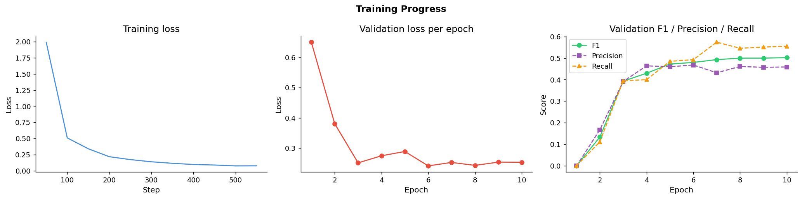
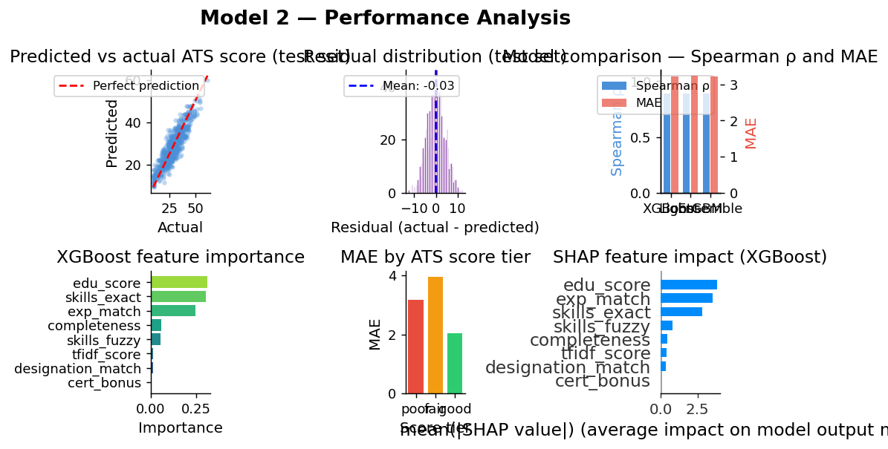

# 🎓 Smart Campus Recruitment System

An automated, AI-driven pipeline designed to streamline campus placements. This system parses unstructured PDF resumes into structured data using Deep Learning (NER), evaluates them against specific Job Descriptions to generate an actionable ATS score, and uses vector-based similarity search to recommend the most highly-relevant real-world job postings for the candidate.

## 🏗️ Repository Structure

```text
Smart-Campus-Recruitment-System/
│
├── Model1_Resume_Parser/
│   ├── resume_parser_model/     # (Downloaded externally due to size)
│   ├── resume_parser.py         # Inference wrapper
│   ├── requirements.txt         
│   └── resume_parser_model1.ipynb 
│
├── Model2_Resume_Scorer/
│   ├── resume_scorer_model/     # (Downloaded externally)
│   ├── resume_scorer.py         # Inference wrapper
│   ├── requirements.txt
│   └── resume_scorer_model2.ipynb 
│
├── Model3_Job_Recommender/
│   ├── job_recommender_model/   # (Downloaded externally)
│   ├── job_recommender.py       # Inference wrapper
│   ├── requirements.txt
│   └── job_recommender_model3.ipynb 
│
├── .gitignore
└── README.md
```

## Model 1: Resume Parser (BERT NER)

The first module is a custom Named Entity Recognition (NER) model fine-tuned on `bert-base-uncased`. It extracts structured data (Skills, Degrees, Companies, Locations, etc.) from raw PDF resumes to be passed to downstream scoring models.

### Datasets Used: 
1. Kaggle => Resume Entities for NER by Dataturks (https://www.kaggle.com/datasets/dataturks/resume-entities-for-ner)
2. Kaggle => Updated Resume Dataset by Jillani SofTech (https://www.kaggle.com/datasets/jillanisofttech/updated-resume-dataset)

### Performance
* **F1 Score:** 0.5278
* **Precision:** 0.5046
* **Recall:** 0.5533



---

## Model 2: ATS Scorer (Machine Learning Ensemble)

The second module acts as the evaluation engine. Because commercial ATS algorithms are proprietary, this model uses a heavily engineered pseudo-labeling approach to simulate industry-standard scoring. It compares the JSON output from Model 1 against a target Job Description.

### Datasets Used: 
1. Kaggle => LinkedIn Job Postings 2023-2024 (https://www.kaggle.com/datasets/arshkon/linkedin-job-postings)
2. Kaggle => Resume Entities for NER by Dataturks (https://www.kaggle.com/datasets/dataturks/resume-entities-for-ner)

### Architecture
* A weighted ensemble of **XGBoost** and **LightGBM** regressors.

### Feature Engineering (8 Dimensions)
* **Exact Skills Match** (35% weight)
* **TF-IDF Keyword Coverage** (20% weight)
* **Experience Alignment** (18% weight)
* **Education Level Match** (12% weight)
* **Fuzzy Skills Match** (5% weight)
* **Job Title / Designation Match** (5% weight)
* **Certification Bonus** (3% weight)
* **Resume Completeness** (2% weight)

### Performance (Test Set)
* **Spearman ρ:** 0.8841 (Excellent ranking capability)
* **MAE:** 3.254 (Mean error of only ~3 points out of 100)
* **RMSE:** 4.044

### Output
An overall ATS score (0-100), section-level scores, missing keywords, and an AI-generated list of actionable suggestions to improve the resume.



---

## Model 3: Job Recommender Engine (Vector Search & Re-ranking)
The final module is a high-performance recommendation system that matches a student's parsed resume against a live database of over 75,000 real-world job postings in milliseconds. It uses a two-stage retrieval and re-ranking pipeline.

# Datasets Used:
Kaggle => LinkedIn Job Postings 2023-2024 (Filtered to 75.4k tech-focused roles) [https://www.kaggle.com/datasets/asaniczka/1-3m-linkedin-jobs-and-skills-2024]

## Architecture
# Stage 1 (Retrieval): 
Uses SentenceTransformer (all-MiniLM-L6-v2) to encode jobs and resumes into 384-dimensional space. Candidates are retrieved instantly using a FAISS (FlatIP) vector index.

# Stage 2 (Re-ranking): 
A heavily optimized XGBoost & LightGBM ensemble re-ranks the top 100 candidates based on explicit rules to ensure perfect alignment.

# Feature Engineering (12 Dimensions):
Includes Semantic Similarity Score, Exact Skill Overlap, Skill Match Ratio, Experience Level Constraints (Entry/Senior/Internship), Location Matching, and Semantic Title Similarity.

# Performance (Test Set)
* **NDCG@10:** 0.9853
* **Precision@5:** 0.9818
* **MRR:** 1.0000
(Note: Achieves near-perfect ranking due to aggressive mathematical alignment on hard skills and experience levels).

## 🚀 How to Run Locally

### Step 1: Clone the Repository
```bash
git clone https://github.com/shubhware/Smart-Campus-Recruitment-System.git
cd Smart-Campus-Recruitment-System
```
### Step 2: Download the Pre-Trained Weights
Because the model artifacts contain large weight files (~400MB for BERT), they are hosted securely externally rather than on GitHub.

1. Model 1 (Parser): (https://drive.google.com/file/d/1yhSuiCwkQmNn56UR6bEDx6-BjzNoqnNC/view?usp=share_link)

2. Model 2 (Scorer): (https://drive.google.com/file/d/18UELix1nMT7TZO2pYKWLLNa0e-FVxuI9/view?usp=share_link)

3. Model 3 (Recommender): (https://drive.google.com/file/d/1R8JnAuoMLmbKN_X-aJXlZVJon2azL-Mb/view?usp=share_link)

### Step 3: Extract and Organize
1. Extract the downloaded .zip files.

2. Place the contents of Model 1 inside the Model1_Resume_Parser/resume_parser_model/ directory.

3. Place the contents of Model 2 inside the Model2_Resume_Scorer/resume_scorer_model/ directory.

4. Place the contents of Model 3 inside the Model3_Job_Recommender/job_recommender_model/ directory.

### Step 4: Environment Setup

## For the Parser (Model 1):
```bash
cd ../Model1_Resume_Parser
pip install -r requirements.txt
```
## For the Scorer (Model 2):
```bash
cd ../Model2_Resume_Scorer
pip install -r requirements.txt
```
## For the Recommender (Model 3): 
```bash
cd ../Model3_Job_Recommender
pip install -r requirements.txt
```